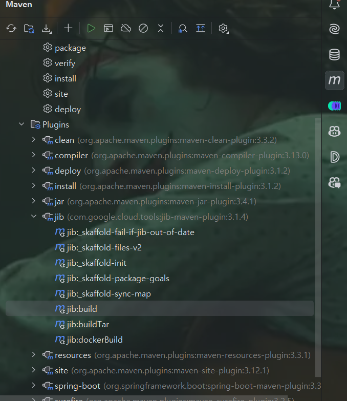
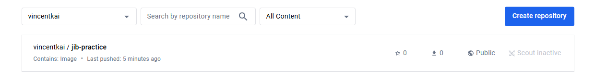

# JIB

最近公司在使用 JIB 构建 docker 镜像，我之前也沒聽過這個東西，不過可以一件打包成 imgae 並且推到指定的 repository，實在是很方便。

這樣就可以省去撰寫 Dockerfile 的麻煩， JIB 是一個專門用來構建 Docker 鏡像的工具，它可以將 Java 應用程序打包成 Docker 鏡像，還可以直接將 Docker 鏡像直接推到指定的 repository 去，實在很方便。 JIB 支持 Maven 和 Gradle，那我們就來玩玩看吧!

## Make your hands dirty

1. 先來到 spring initializr 建立一個新的專案，選擇 Maven Project，然後選擇 Spring Boot 版本，填入 Group、Artifact，Dependencies 就選個 Web 即可，然後點選 Generate 下載專案。

2. 新增一個 Controller 來測試一下，新增一個 Controller.java

```java
@RestController
public class Controller {

    @GetMapping("/")
    public String hello() {
        return "Hello, JIB practice!";
    }

}
```

3. 啟動一下，再到瀏覽器輸入 http://localhost:8080/ 看看有沒有正常運作。

4. 接下來我們要開始使用 JIB 來打包我們的專案，首先我們要在 pom.xml 中加入 JIB 的 plugin。
    我們來解釋一下其中有用到的 tag:
    - `from`: 這裡是指定要使用的 base image，這裡我們使用 `openjdk:17-jdk-alpine`，表示我們的專案會使用 java 17 的 jdk。
    - `to`: 這裡是指定要推送的 repository，這裡我使用我自己的 docker hub `docker.io/vincentkai/jib-practice`，表示我們要推送到 docker hub 上的 vincentkai/jib-practice repository。你可以換成你自己的 repository。
    - `auth`: 這裡是指定要使用的 repository 的帳號密碼，我的帳號密碼是 ***** 不告訴你，你要換成你自己的帳號密碼。
    - `container`: 這裡是指定 container 的一些設定。
        - `mainClass`: 這裡是指定要執行的 main class，這裡是 `com.kai.jib_practice.JibPracticeApplication`。
        - `ports`: 這裡是指定要開啟的 port，這裡是 8080。
    - 其實這邊的設定看起來 dockerfile 挺類似的，只是這邊是用 xml 的方式來設定。有了這些設定後，就取代了 dockerfile 的功能。
```xml
<plugin>
    <groupId>com.google.cloud.tools</groupId>
    <artifactId>jib-maven-plugin</artifactId>
    <version>3.1.4</version>
    <configuration>
        <from>
            <image>openjdk:17-jdk-alpine</image>
        </from>
        <to>
            <image>docker.io/vincentkai/jib-practice</image>
<!--						<image>your repo path and image name</image>-->
            <auth>
                <username>your-username</username>
                <password>your-password</password>
            </auth>
        </to>
        <container>
            <mainClass>com.kai.jib_practice.JibPracticeApplication</mainClass>
            <ports>
                <port>8080</port>
            </ports>
        </container>
    </configuration>
</plugin>
```

5. 接下來打包一下我們的專案成 jar 檔，如果你本地有 maven 的話，就使用以下指令，如果沒有的話，intellij 右側有 maven 的選項，可以點選進去，然後選擇 package 來打包。

```shell
mvn clean package
```

6. 接下來我們就可以使用 JIB 來打包我們的專案成 docker image，在 intellij 的右側有 maven -> Plugins -> jib -> jib:build，點選這個就可以開始打包了。


7. 打包完成後，我們可以到 docker hub 上看看有沒有成功推送，這裡我們可以看到我們剛剛推送的 image。


8. 最後我們就直接使用 `docker run` 來執行我們的 image 吧!

```shell
docker run -it -d -p 8080:8080 docker.io/vincentkai/jib-practice
```

9. 最後我們可以到瀏覽器輸入 http://localhost:8080/ 看看有沒有正常運作。


## Conclusion

這樣就完成了使用 JIB 來打包我們的專案成 docker image，並且推送到 docker hub 上，實在是很方便，不用再撰寫 Dockerfile，只需要在 pom.xml 中設定一下就可以了，希望這篇文章對你有幫助，謝謝你的閱讀。

我把我的案例放在 [github](https://github.com/mister33221/spring-boot-jib-practice.git) 上，有興趣的可以參考一下。

## Reference

[https://blog.csdn.net/Tingnichui/article/details/122813536](https://blog.csdn.net/Tingnichui/article/details/122813536)  
[https://matthung0807.blogspot.com/2020/12/spring-boot-jib-maven-build-image-to-docker-hub.html](https://matthung0807.blogspot.com/2020/12/spring-boot-jib-maven-build-image-to-docker-hub.html)  
[https://b0444135.medium.com/jib%E6%89%93%E5%8C%85spring-boot-40d33dc59ebe](https://b0444135.medium.com/jib%E6%89%93%E5%8C%85spring-boot-40d33dc59ebe)  